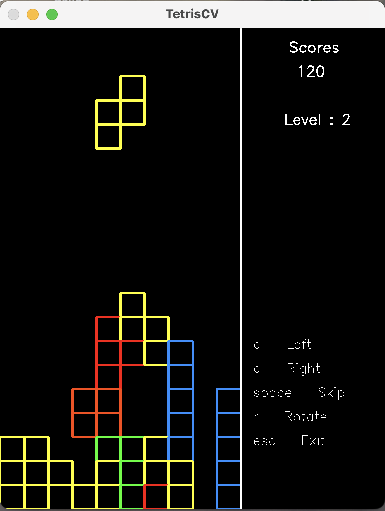
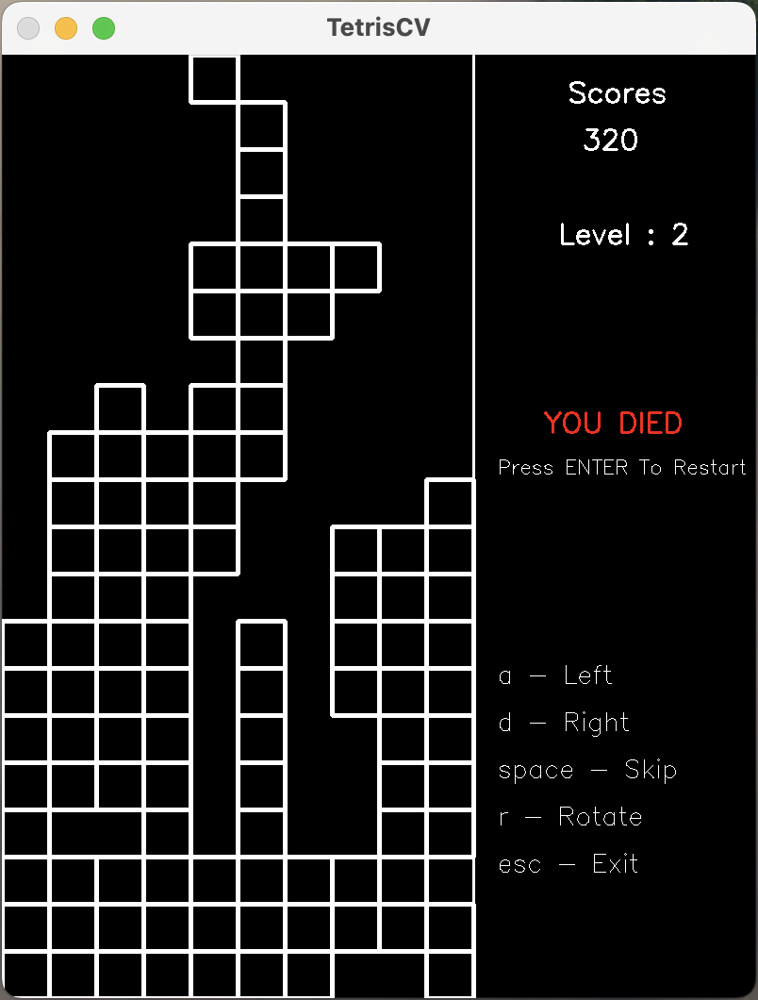
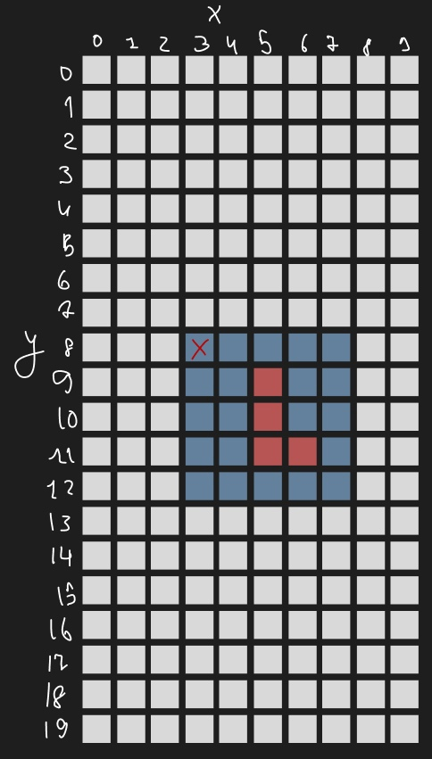

# Tetris OpenCV
Реализация Тетриса с помощью  C++, библиотеки OpenCV и <strong><em><del>Линейного анализа</del></em></strong>.

## Cкриншоты игрового процесса

<div style="display:flex; flex-direction:row; margin-bottom:20px;">
    
    
</div>


## Краткое устройство проекта
### Основные класы 
- Field - хранит игровое поле (двумерный массив 20х10), и отвечает за валидацию и отображение событий на нем.
- Figure - хранит Матрицу(Кастомный класс, представлен ниже) 5х5 с пресетом фигуры. Содержит метод ее поворота с помощью транспонирования матрицы.
- Matrix - реализует матричные умножение и сложение, служит контейнером для тетрамино для  работы с вычислениями при транспонировке.
- GameManger - отвечает за менеджмент игровых циклов.
- GrapicManager - отвечает за графику.

## Линейный Анализ
### Взаимодействие фигуры и поляяф

Фигура хроанитсья в своей матрице, и чтобы отобразить ее на поле используется координаты правого верхнего угла матрицы относительно поля(3;8). Они прибавляются к локальным координатам фигуры и уже переноситься на поле.

{width=300px}

### Наконец про сам линейный анализ. 

Он применяется в проекте для разворота фигуры, путем **транспонирования** матрицы.

Из координат каждой точки фигуры создается матрица 1 на 2 например `(1,0)`, после чего матрично умножается на оператор поворота `rotationOperator`, который представляет из себя:
```
|cos(a), -sin(a)|
|sin(a), cos(a) |
```
В нашем случае угол поворота всегда `a = 90°` в таком случае `rotationOperator` принимает вид `{{0, -1}{1, 0}}`.

И в результате умножения получаются координаты новой точки уже повернутой фигуры. 

```cpp
void Figure::rotate() {
    static Matrix rotationOperator({{0, -1},
                                    {1, 0}});

    auto newField = std::vector<std::vector<bool>>(map.size(), std::vector<bool>(DEFAULT_MATRIX_SIZE));
    for (int it = 0; it < map.size(); ++it) {
        for (int jt = 0; jt < map[it].size(); ++jt) {
            Matrix oldPos(1, 2);
            oldPos.getMatrixData()[0][0] = it - 2;
            oldPos.getMatrixData()[1][0] = jt - 2;
            Matrix newPos = rotationOperator * oldPos;
            newField[newPos.getMatrixData()[1][0] + 2][newPos.getMatrixData()[0][0] + 2] = map[jt][it];
        }
    }

    map = newField;
}
```
